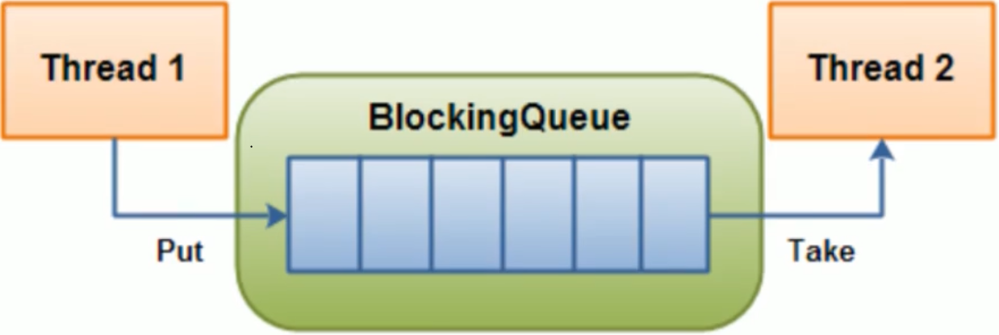

# Java 内存模型

#### volatile: java 虚拟机提供的轻量级的同步机制

1.1 保证可见性(可见性): 保证一个线程修改主内存中的共享变量后,其他线程能及时看到
 在主内存中有一份数据, example: age = 25, 有三个线程同时对 age 操作
 ① 将 age 拷贝到各自的工作内存中,进行修改, 然后将修改后的值赋值给主内存, 如果其中一个线程完成了这个操作, 
   需要通知其他线程主内存的值已经被修改, 其他的线程需要重新获取主内存中的值进行操作
1.2 不保证原子性(原子性)

​	原子性: 不可分割, 完整性, 某个线程在做某个具体操作时, 中间不可以被加塞或分割, 需要整体完整, 要么同时成功, 要么同时失败(保证数据的完整一致性), 在同一时刻某个具体操作只允许有一个线程进行操作

1.3 禁止指令重排(有序性)

​	计算机在执行程序时, 为了提高性能, 编译器和处理器常常会**对指令做重排**, 分为三种情况


​	单线程环境里面确保程序最终执行结果和代码顺序执行的结果一致;

​	处理器在进行重排序时必须考虑指令之间的**数据依赖性**;

​	多线程环境中线程交替执行, 由于编译器优化重排的勋在, 两个线程中使用的变量能否保证一致性时无法确定的, 结果无法预测

1.4 volatile + DCL(DCL Double check lock 双端检索机制) 实现多线程环境下单列模式

```java
public static SingletonDemo getInstance (){
        // DCL Double Check Lock
        if (instance == null){
            synchronized (SingletonDemo.class) {
                if (instance == null){
                    instance = new SingletonDemo();
                }
            }
        }
        return instance;
    }
```

​	在多线程环境下 DCL 机制不一定线程安全, 原因是有指令重排的存在;

​	instance = new Singleton();(由三个指令完成

​	① memory = allocate(); 分配内存空间

​	② instance(memory) 初始化对象

​	③ instance = memory 设置 instance 指向分配的内存地址	

​	由于 ② ③ 不存在数据依赖性, 又由于指令重排的存在, 在多线程的环境下

​	instance = new Singleton(); 重排指令后执行顺序为 ①->③->②

```java
public static SingletonDemo getInstance (){
        // DCL Double Check Lock
        if (instance == null){
            synchronized (SingletonDemo.class) {
                if (instance == null){
                    instance = new SingletonDemo();
                }
            }
        }
        return instance;
    }
多线程环境下: 线程1, 线程2 同时调用 geteInstance() 方法
线程1 执行到 instance = new SingletonDemo();由于指令重排的存在
① memory = allocate(); 分配内存空间
③ instance = memory 设置 instance 指向分配的内存地址
线程1 执行完① 和 ③ 的指令
线程2 执行到 if (instance == null) 这行代码, 此时 instance 指向了分配好的内存空间,instance 不为 null 线程2 直接返回,由于②instance(memory) 没有进行初始化, 但instance = memory 指向的内存空间里面实际是没有值;所以会造成线程安全
```

​	

#### JMM(Java memory model) Java内存模型: 描述的是一组规则和规范, 定义了程序中各个变量(实例字段, 静态字段, 构成数组对象的元素)的访问方式

 实例字段, 静态字段, 构成数组对象的元素称之为共享变量
  主内存(物理内存, 内存条), 共享区域内存, 对所有线程共享
  工作内存, 线程对变量的操作必须在工作内存中完成
JMM 关于同步的规定:

三大特性
  	 可见性
  	 原子性
  	 有序性

  ① 线程解锁前必须把共享变量的值刷回主内存

#### CAS

1: compare and set 比较并交换;

​    

```java
AtomicInteger atomicInteger = new AtomicInteger(5);
初始值为 5, compareAndSet(6, 1016): 如果初始值为 6 就想初始值变更为 1016
boolean b = atomicInteger.compareAndSet(6, 1016);
```

原理: 自旋锁 和 unsafe

① atomicInteger.getAndIncrement() 为什么能保证原子性

```java
AtomicInteger class	
	// 保证了可见性
	private volatile int value;
	// 带初始值构造方法
	public AtomicInteger(int initialValue) {
        value = initialValue;
    }	
	/**
     * Atomically increments by one the current value.
     *
     * @return the previous value
     */
    public final int getAndIncrement() {
      	// this 当前对象, valueOffset 偏移量, 当前对象内存地址, 1 每次调用之后, 在原始值的基础上加 1
        return unsafe.getAndAddInt(this, valueOffset, 1);
    }
Unsafe class{
  public final int getAndAddInt(Object var1, long var2, int var4) {
        int var5;
        do {
          	// 获取当前对象 var1 内存地址为 var2 对象的值
            var5 = this.getIntVolatile(var1, var2);
          	// this.compareAndSwapInt(var1, var2, var5, var5 + var4)
          	// 获取 var5 后, 比较内存中的值是否一致, 如果一致, 就替换, 并返回获取的 var5
          	// 如果不一致, 重新获取比较, 获取的值和内存中的值一致
        } while(!this.compareAndSwapInt(var1, var2, var5, var5 + var4));

        return var5;
    }
}
```

Unsafe (sun.misc)

​	是 CAS 的核心类, 由于 java 方法无法直接访问底层系统, 需要通过本地方法(native) 来访问, Unsafe 相当于一个后门. 基于该类可以操作特定内存中的数据. 其内部方法可以像 C 的指针一样直接操作内存

​	CAS Compare-And-Set 它是一条 CPU 并发原语

​	它的功能是判断内存某个位置的值是否为预期值, 如果是则替换为新值, 这个过程是原子性的

​	CAS 并发原语体现在 Unsafe 类中的各个方法(native 修饰), 这是一种完全依赖于硬件的功能, 通过它实现原子操作. CAS 是一种系统原语, 由若干条制定组成, 用于完成某个功能的一个过程. 并且原语在执行时必须保证时连续的, 在执行过程中不允许被中断,, 也就是说 CAS 是一条 CPU 原子指令. 不会造成数据不一致的问题

2. CAS 缺点

   ① do while 循环时间长, 导致 cpu 开销大

   ② 只能保证一个共享变量的原子操作

   ③ 引出来 ABA问题

   ABA 问题: CAS 算法实现的一个重要前提需要取出内存中某一时刻的数据并在当下时间比较并替换, 在这个时间差内会导致数据变化(只管结果,不管过程)

   A, B 两线程; 主内存中原始值为 10, A 线程每次执行只需要 2 秒, B 线程每次执行需要 10 秒, 第一次 A 线程将主内存中值修改为 12, 第二次又将值修改为 10, 然后 B 线程获取主内存中值为 10, 然后修改; 在B 线程操作前, 主内存中的值已经被 A 线程修改过一次了. 在多线程高并发情况下, 在 B线程操作这个共享变量前的这个时间差内, 数据是变化的;

   AtomicReference, AtomicStampedReference 原子引用类, 通过 AtomicStampedReference 解决 CAS ABA 问题

   #### 集合类不安全问题

   1 产生原因; java.util.ConcurrentModificationException 并发修改异常

   ​	ArrayList 线程不安全的; 在多线程环境下, 一个线程在进行写操作时, 另一个线程进行读操作, 造成数据不一致

   2 解决方法

   ​	使用 Vector , Vector.add() 使用了synchronize ,解决安全问题, 降低了并发性

   ​	Collections.synchronizeList(new ArrayList()); 

   ​	new  CopyOnWriteArrayList(); 写时复制, 读写分离的思想, 读和写为不同容器

   ```java
   List<T> list = new CopyOnWriteArrayList<>();

   public class CopyOnWriteArrayList {
   	private transient volatile Object[] array;

   	public CopyOnWriteArrayList() {
           setArray(new Object[0]);
       }

   	public boolean add(E e) {
         	// 获取锁
           final ReentrantLock lock = this.lock;
         	// 加锁
           lock.lock();
           try {
             	// 获取原对象
               Object[] elements = getArray();
               int len = elements.length;
             	// 复制新对象, 并长度加 1
               Object[] newElements = Arrays.copyOf(elements, len + 1);
             	// 添加新元素
               newElements[len] = e;
             	// 将原对象引用指向新集合对象
               setArray(newElements);
               return true;
           } finally {
             	// 释放锁
               lock.unlock();
           }
       }

   	// 将原对象引用指向新集合对象
   	final void setArray(Object[] a) {
           array = a;
       }

   	final Object[] getArray() {
           return array;
       }
   }
   ```

   #### ​值传递和引用传递

   八种基本数据类型都存在于栈中, 方法间相互调用, 基本类型传递为值传递, 不会改变原来的值;

   引用类型在方法之间调用传递为引用传递, 对象中属性值的改变会影响到原来的对象;

   String 存在于常量池中

   ```java
   		String str1 = "abc"; // 这种直接赋值, 会先判断常量池中是否存在 abc, 存在复用, 不存在新建
   		String str2 = new String("abc"); // 这种 new 的方式, 属于新建一个对象, 存在于堆中
   		System.out.println(str1 == str2);// 比较的是内存地址
   		String str3 = new String("abc");
   		System.out.println(str3 == str2); // 比较的是内存地址
   		
   ```

   #### java锁之公平和非公平锁

   ReentrantLock(默认非公平锁): 可重入锁, 公平所, 非公平锁

   可重入锁(递归锁): 同一线程外层函数获得锁之后, 内层递归函数仍然能获得该锁的代码, 在同一线程在外层方法获得锁的时候, 再进入内层方法会自动获得锁; 也就是说线程可以进入任何一个它已经获得锁所同步的代码块

   ```java
   public void sync method01 (){
     	// 同一线程获得方法 method01 的锁, 将自动获得 method02 方法的锁
   	method02();
   }
   public void sync method02 (){
     
   }
   ```

   公平锁: 指多个线程按照申请锁的顺序获取锁; **保证有序性**

   非公平锁: 指多个线程获取锁的顺序不是固定的, 有可能后申请的线程先获取锁, 在高并发情况下, 有可能造成反转和饥饿现象(有可能先申请的线程一直获取不到锁), 当后申请的线程失败后会采用类似公平锁的方式; **增加吞吐量**

   synchronize 一种非公平锁

   #####自旋锁(spinlock)

   指尝试获取锁的线程不会立即阻塞, 而是通过循环的方式去尝试获取锁, 这样的好处是减少线程上下文的消耗, 缺点是会消耗 CPU; 因为循环会消耗 CPU	应用在程序处理快速的地方

   ```java
   package com.yangyun.study.thread;

   import java.util.concurrent.atomic.AtomicReference;

   /**
    * @author yangyun
    * @create 2019-06-22-11:22
    */
   public class SpinLockDemo {
       AtomicReference<Thread> atomicReference = new AtomicReference<>();

       public void myLock (){
           Thread thread = Thread.currentThread();
           System.out.println(thread.getName() + "\t come in");

           while (!atomicReference.compareAndSet(null, thread)){

           }
       }

       public void myUnLock (){
           Thread thread = Thread.currentThread();
           System.out.println(thread.getName() + "\t invoked");
           atomicReference.compareAndSet(thread, null);
       }

       public static void main(String[] args) throws InterruptedException {
           SpinLockDemo spinLockDemo = new SpinLockDemo();

           new Thread(() -> {
               spinLockDemo.myLock();
               // 业务代码处理
               try {
                   Thread.sleep(5000);
               } catch (InterruptedException e) {
                   e.printStackTrace();
               }
               // 释放锁
               spinLockDemo.myUnLock();
           }, "AA").start();

           Thread.sleep(1000);

           new Thread(() -> {
               spinLockDemo.myLock();

               spinLockDemo.myUnLock();
           }, "BB").start();
       }
   }

   ```

##### 读写锁(ReentrantReadWriteLock 其读锁是共享锁, 写锁是独占锁)

ReentrantLock synchronized 为独占锁

独占锁(写锁): 同一时刻只能有一个线程操作资源类, **保证高效的并发性**

共享锁(读锁): 同意时刻可以有多个线程同时操作资源类

互斥锁(读写, 写读, 写写 互斥)

##### 阻塞队列

BlockQueue: 不需要关心线程的阻塞和唤醒




线程1 往队列中存元素, 线程2 从队列中取元素;

当队列中满元素时, 线程1 **生产**元素将被阻塞, 等待队列中元素减少

当队列中没有元素时, 线程2 **获取**元素将被阻塞直到队列中有新元素


##### 线程池

实现多线程几种方式

​	① Thread ② Runnable ③ Callable ④ 通过 Executors 创建线程池的方式

Thread implements Runnable

Callable 有返回结果, 会抛异常;  针对并发, 异步的情况而出现; 可以使用 FutureTask 来接收返回的结果

**为什么使用线程池, 线程池的优势;**

线程池做的工作主要是控制运行的线程数量, 处理过程中将任务放入队列, 然后在线程创建后启动这些任务, 如果线程数量超过最大数量, 超出数量的线程排队等候, 直到其他线程执行完, 再从队列中取出任务来执行.

**线程池的主要特点: 统一管理, 线程复用, 控制最大并发数**

**优势**

① 复用线程, 降低资源消耗; 创建和销毁的资源消耗

② 线程复用, 省略了创建线程的时间, 提高了相应速度

③ 提高线程的统一管理. 线程是稀缺资源, 如果无限制创建, 不仅会消耗系统资源, 还会降低系统的稳定性, 使用线程池可以进行统一分配,调优和监控


